```{r setup, include=FALSE}
options(htmltools.dir.version = FALSE)
```

```{r xaringan-themer, include=FALSE, warning=FALSE}
library(xaringanthemer)
style_duo()
```

.center[
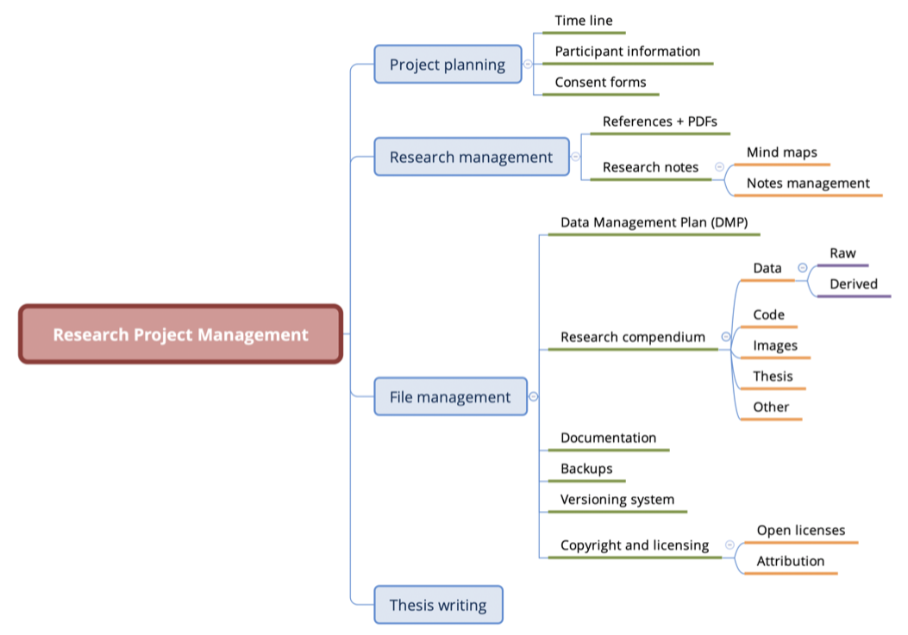
]

---

# Research compendium

> A **research compendium** accompanies, enhances, or is a scientific publication providing data, code, and documentation for reproducing a scientific workflow.

—[Research Compendium](https://research-compendium.science)

--

> A **research compendium** is a collection of all digital parts of a research project including data, code, texts (protocols, reports, questionnaires, meta data). The collection is created in such a way that reproducing all results is straightforward.

—[The Turing Way: Research Compendia](https://the-turing-way.netlify.app/reproducible-research/compendia.html)

---

# Organise your files

- Create one folder and make that the folder for your dissertation project.

- In that folder, create folders for `data/` and for `scripts/` (and `plots/`, `dissertation/`, etc).

--

- In `data/` have a `raw/` and `derived/` folder:

  - Raw data (data that, if lost, it is very unfortunate; for example, experiment data, data which was manually annotated, etc) should be saved in `data/raw/`.
  
  - Derived data (data that is derived with scripts) should be saved in `data/derived/`.

---

.center[
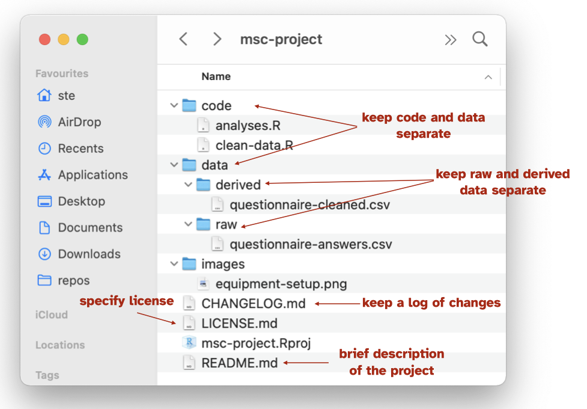
]

---

# Backup, backup, BACKUP!

**Make sure you have a backup system in place.**

--

- Saving copies of the entire folder in an external hard drive.

- Saving copies of the entire folder in an online storage service (iCloud Drive, One Drive, DropBox, Google Drive, ...).

- Using a versioning system like [git](https://www.atlassian.com/git).

---

# Research projects are dyanamic

- Be prepared to change how files and folders are organised after you start.

- Projects evolve over time and sometimes you need to clean things up.

--

- Use a **good** system to mark versions in your files. Two simple systems:

  - Use full DATE in the file name
      - `dissertation-2022-11-21`.
      - `dissertation-2023-03-01`.

  - Use version number
      - Inspired by [Semantic versioning](https://www.geeksforgeeks.org/introduction-semantic-versioning/) from programming but can be helpful with research files too!
      - `dissertation-v1.0`.
      - `dissertation-v1.1`.
      - `dissertation-v2.0`.

---

# DON'T DO THIS

.center[
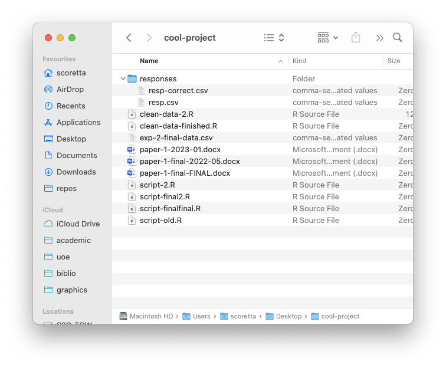
]

---

# Types of data

- Tabular (or rectangular) data (like spreadsheets).

- Audio and/or video recordings.

- Texts or transcripts.

- Annotation (ELAN, TextGrids, ...).

- Images.

- ...

---

# Tabular data

- Tabular data is made of **rows and columns**.

- Prefer formats like Comma Separated Values (`.csv`) or Tab Separated Values (`.tsv`) over MS Excel.

- If you use Excel, **keep one sheet per Excel file**! (Don't have data in multiple sheet within the same Excel file).

- Include **ONE TABLE per file**. (You can transform and summarise data in R).

---

# Tabular data: DON'T

.center[
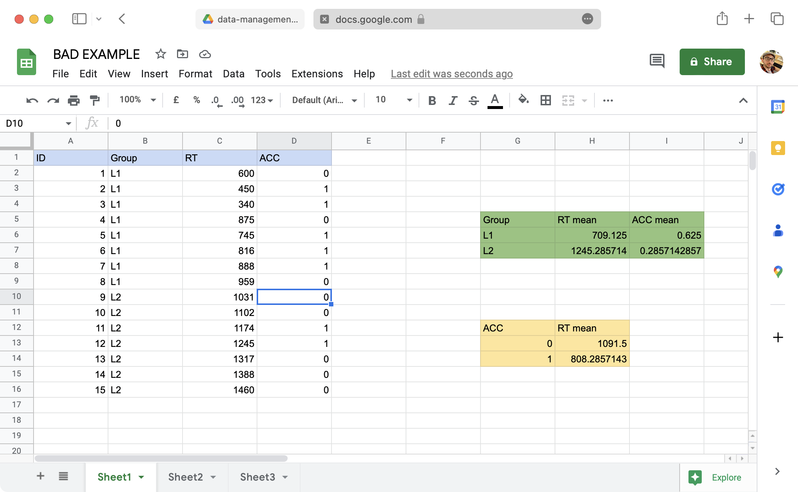
]

---

# Coding data

Use **explicit coding**:

- **Don't use colours** to code your data! (Software like R will discard colours and any formatting).

- Each variable to be coded should have **its own column**.

- Use **clear labels**:

  - ACCURACY: incorrect, correct.
      - Not 0, 1.
  - DYSLEXIC: dyslexic, non-dyslexic (or control).
      - Not 0, 1 or yes, no.
  - VOWEL: a, i, u.
  - YEAR ABROAD: year_abroad, no_abroad
      - Not yes, no.
  
---

# Coding data: DON'T

.center[
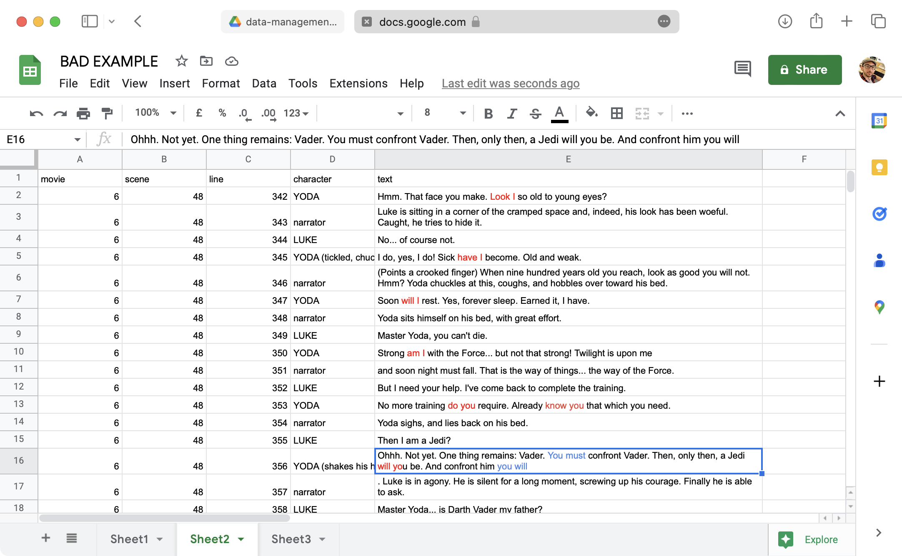
]

---

# Coding data: DON'T

.center[
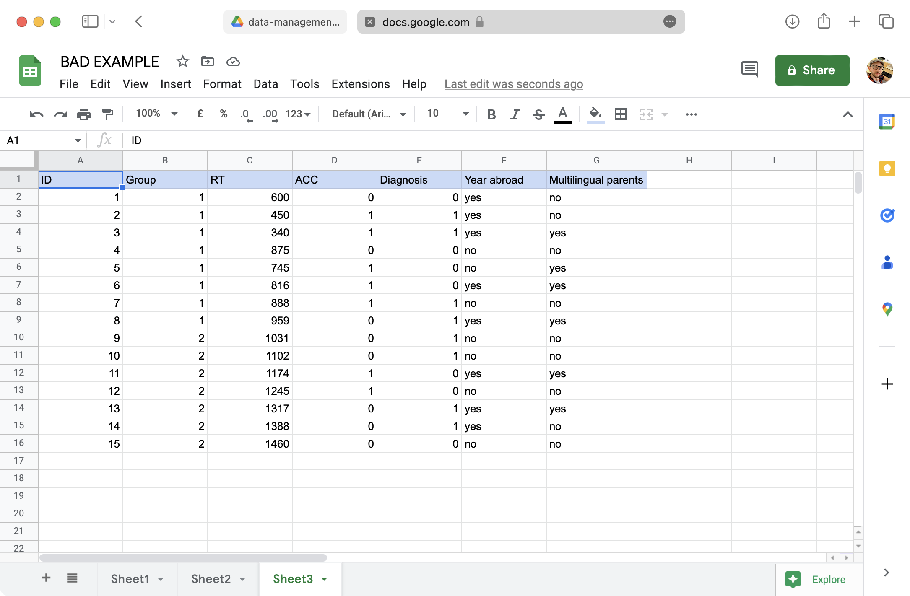
]

---

# Coding data: DO

.center[
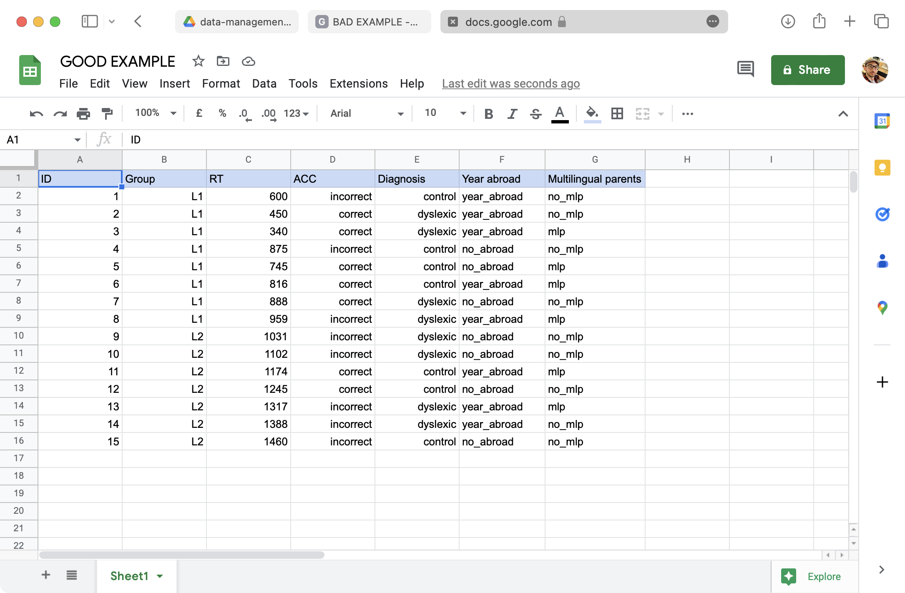
]

---

# Tidy data

.center[

]

???

https://github.com/allisonhorst/stats-illustrations

---

# Tidy data

.center[

]

???

https://github.com/allisonhorst/stats-illustrations

---

# Tidy data: DON'T

.center[
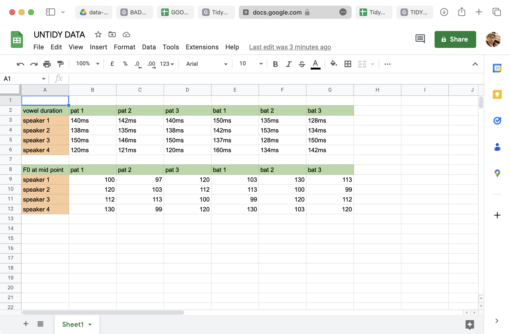
]

---

# Tidy data: DO

.center[
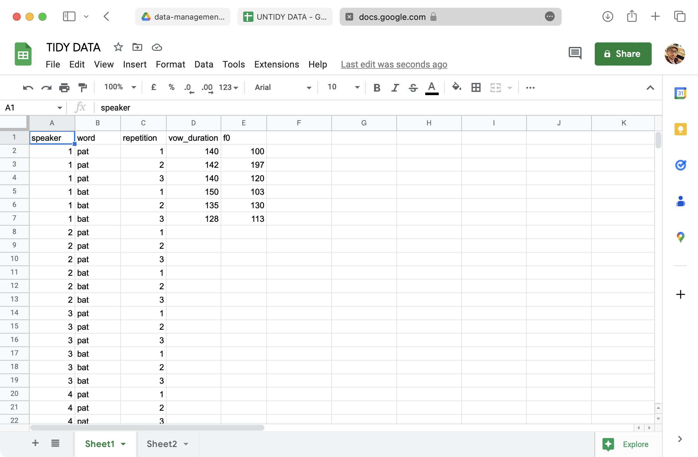
]

---

# Tidy data: DO

.center[
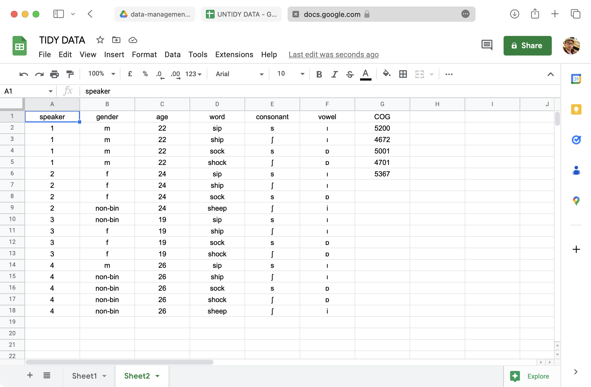
]

---

# Tidy data: DO

.center[
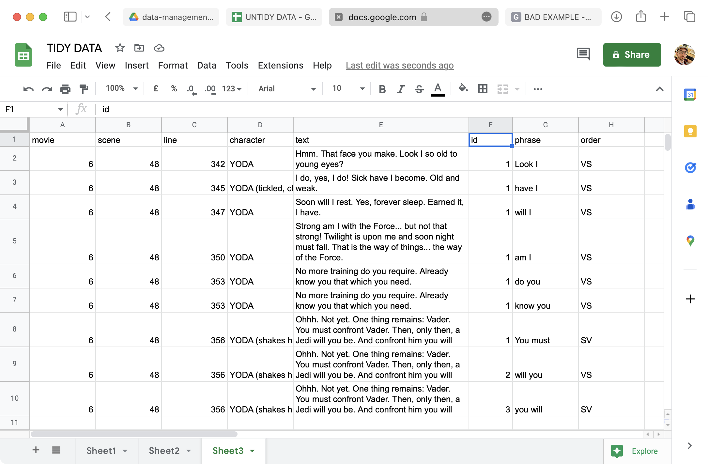
]

---

# Summary

- **Organise your files** and keep track of **file versions**.

- Make sure you **backup frequently**!

- Code your data using **clear labels** and **tidy data** principles.

--

### Stats support for dissertation

- Book an **appointment with me**.

- **Plan your data analysis while designing your study!**
